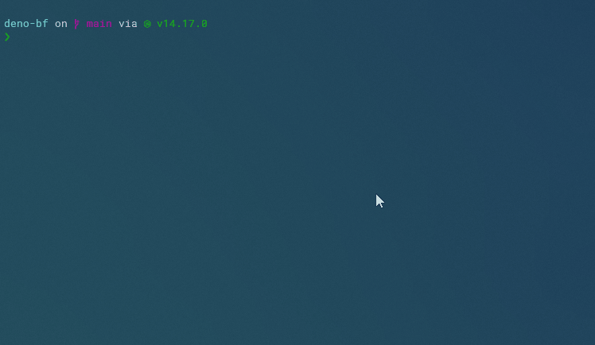

# DENO-BF

TypeScriptでBrainfxxkのインタプリタを作る．

Deno, cliツール，brainfxxkの入門．

## Usage

### REPL

REPLを起動します．

`$ deno run main.ts`

### Read from file

ファイルの中身を読んで実行します．

`$ deno run --allow-read main.ts -f helloworld.bf`

### Print finally mem state

最終的なメモリの状態を表示します．

`$ deno run main.ts -p`

## MEMO

入力を受け取ってポインタの指す位置に入れる `,` 命令は簡略のため実装してないです． 